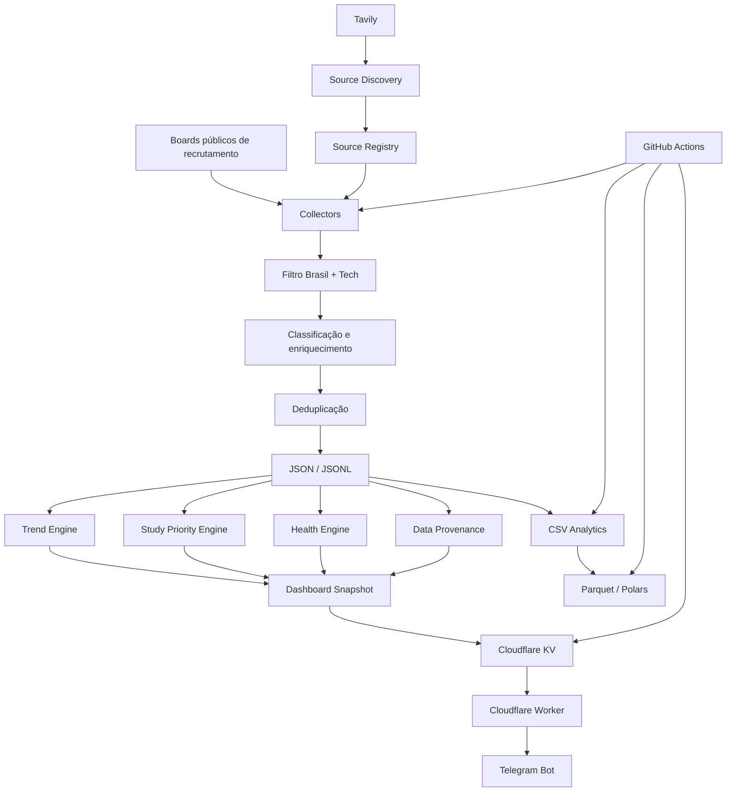

# 🧠 Michael Opportunity Intelligence

> Sistema automatizado de inteligência de mercado e carreira que coleta vagas públicas de tecnologia, transforma os dados em histórico comparável, identifica tendências, mede a saúde da coleta e entrega insights pelo Telegram.


## Visão geral

O **Michael Opportunity Intelligence** trata o mercado de vagas de tecnologia como um conjunto de dados analisável ao longo do tempo. Em vez de apenas listar vagas, o projeto coleta, normaliza, classifica, deduplica, persiste e cruza sinais do mercado para responder perguntas como:

- quais tecnologias aparecem com mais frequência;
- quais skills estão acelerando ou desacelerando;
- quais empresas aumentaram o volume de oportunidades;
- como está o mercado de estágio e júnior;
- quais áreas têm maior demanda;
- o que priorizar nos estudos considerando mercado + objetivo profissional;
- se a coleta atual está saudável o suficiente para sustentar análises.

## Snapshot de referência

Em um snapshot de referência de agosto de 2026, a operação privada registrava centenas de vagas ativas, centenas de vagas únicas no histórico, dezenas de empresas e dezenas de fontes monitoradas.

> Os números representam **a amostra monitorada pelo sistema**, não a totalidade do mercado de trabalho brasileiro.

Esta versão pública contém somente uma **amostra reduzida dos dados**. O dataset operacional completo permanece privado.

## Arquitetura



## Fontes de dados

O projeto prioriza **boards públicos de recrutamento das próprias empresas**, via ATS (*Applicant Tracking Systems*).

ATS suportados na operação atual:

- **Greenhouse**
- **Lever**
- **Ashby**
- **Workable** em estágio de integração/validação

### Tavily

O Tavily é usado como **motor de descoberta de novas fontes**. Ele não é a origem principal das vagas usadas nas estatísticas.

Fluxo:

```text
Tavily
  ↓
descobre novo board público
  ↓
identifica ATS
  ↓
registra e valida a fonte
  ↓
confere vagas tech elegíveis para Brasil
  ↓
incorpora à cobertura
```

## Pipeline

```text
Fonte pública
   ↓
Coleta do ATS
   ↓
Elegibilidade Brasil
   ↓
Filtro de vaga tech
   ↓
Extração de skills
   ↓
Classificação de senioridade
   ↓
Classificação por área
   ↓
Detecção de fontes espelhadas
   ↓
Deduplicação
   ↓
Persistência + Analytics
```

Campos enriquecidos incluem, entre outros:

```text
id
company
title
location
url
seniority
area
skills
first_seen
last_seen
```

## Classificação

O sistema possui regras próprias para classificar senioridade e área.

### Senioridade

- Estágio
- Júnior
- Pleno
- Sênior
- Não informado

### Áreas

- Engenharia de Software
- Backend
- Frontend
- Full Stack
- Dados
- IA / Machine Learning
- Visão Computacional
- DevOps / Cloud
- Segurança
- Mobile
- QA / Testes
- Arquitetura / Soluções
- Banco de Dados
- Suporte Técnico

A suíte de testes cobre casos de qualidade como não confundir **Java com JavaScript**, **Rust com Trust** e outros falsos positivos de classificação.

## Deduplicação e cobertura

O sistema trabalha em duas camadas:

1. **deduplicação de vagas** por identificador estável;
2. **detecção de fontes espelhadas**, evitando contar duas vezes boards com alto grau de sobreposição.

Um dos casos detectados durante o desenvolvimento foi uma forte sobreposição entre boards de AB InBev e BEES.

## Hiring Momentum / Trend Engine

Snapshots de mercado registram metadados de comparabilidade:

```text
source_count
coverage_signature
schema_version
classifier_version
```

O motor só compara períodos quando cobertura e metodologia permanecem equivalentes. Isso evita interpretar a descoberta de novas fontes como crescimento artificial do mercado.

## Study Priority Engine

Cruza sinais como:

- demanda geral;
- mercado de entrada;
- áreas-alvo;
- tendência;
- alinhamento de carreira.

O resultado é um ranking de skills com ações como **aprender** ou **aprofundar**, evitando recomendar tecnologias apenas porque são populares.

## Health Score

A coleta recebe um score de saúde de **0 a 100** baseado em:

| Dimensão | Peso |
|---|---:|
| Recência | 20 |
| Cobertura | 25 |
| Consistência do volume | 20 |
| Qualidade dos registros | 25 |
| Integridade da persistência | 10 |

O objetivo é detectar anomalias técnicas antes que elas contaminem análises de tendência.

## Proveniência e transparência

O bot possui comandos específicos para explicar os dados:

```text
/dados        origem e qualidade
/fontes       fontes monitoradas
/metodologia  tratamento aplicado
/saude        diagnóstico da coleta
```

Isso adiciona uma camada de **data lineage / data provenance** ao projeto.

## Telegram Bot

Principais comandos:

```text
/resumo
/skills
/empresas
/tendencias
/junior
/ia
/dev
/estudar
/semanal
/dados
/fontes
/metodologia
/saude
/status
/ajuda
```

## Persistência e Analytics

A operação privada trabalha com três camadas principais:

- **JSON / JSONL** — fonte operacional e histórica;
- **CSV** — Power BI, Excel, Pandas e análise exploratória;
- **Parquet** — análise otimizada com Polars/DuckDB.

Os Parquets operacionais não são mantidos nesta versão pública. A automação privada os gera e publica temporariamente como GitHub Actions Artifacts.

## Automação

A operação privada executa coleta várias vezes ao dia e mantém um Source Discovery recorrente. GitHub Actions executa validações, testes, coleta, persistência, geração de snapshot, exports analíticos e sincronização com a camada operacional.

A configuração pública é propositalmente sanitizada e não contém IDs ou endpoints privados.

## Estrutura desta versão pública

```text
michael-opportunity-intelligence-public/
├── config/
├── src/
│   ├── collectors/
│   ├── discovery/
│   ├── exports/
│   ├── intelligence/
│   └── storage/
├── tests/
├── worker/
├── data/
│   └── sample/
├── .env.example
└── README.md
```

## Dados públicos de exemplo

`data/sample/` contém somente uma pequena amostra suficiente para demonstrar schemas e análises.

O repositório operacional completo, histórico de coleta, estados internos e credenciais permanecem privados.

## Segurança

Nenhuma credencial real deve ser versionada. Variáveis usadas pelo projeto incluem:

```text
TAVILY_DISCOVERY_API_KEY
TELEGRAM_BOT_TOKEN
TELEGRAM_OWNER_CHAT_ID
OPPORTUNITY_SYNC_SECRET
OPPORTUNITY_SYNC_URL
```

Em produção, elas ficam em GitHub Secrets / Cloudflare Secrets.

## Testes

O projeto usa `unittest` para validar classificadores, parsers de ATS, deduplicação, storage e motores de inteligência.

```bash
python3 -m unittest discover -s tests -v
```

## Roadmap

### Concluído

- [x] coleta multi-ATS
- [x] Greenhouse
- [x] Lever
- [x] Ashby
- [x] Source Discovery com Tavily
- [x] deduplicação de vagas
- [x] detecção de fontes espelhadas
- [x] classificação por área e senioridade
- [x] extração de skills
- [x] histórico de mercado
- [x] Hiring Momentum
- [x] Study Priority Engine
- [x] CSV Analytics
- [x] Parquet Analytics
- [x] Telegram Bot
- [x] Cloudflare KV / Worker
- [x] Data Provenance
- [x] Health Score

### Próximas evoluções

- [ ] Opportunity Alert Engine
- [ ] score de compatibilidade por vaga
- [ ] alertas automáticos de alto match
- [ ] Company Intelligence Engine
- [ ] Career Gap Analyzer
- [ ] expansão para novos ATS
- [ ] integração de dados públicos do mercado de trabalho

## Aviso

Projeto desenvolvido para estudo, portfólio e inteligência pessoal de mercado. Utiliza informações disponibilizadas publicamente por páginas e sistemas de recrutamento. Os dados derivados representam uma amostra observacional e devem respeitar os termos e políticas aplicáveis às fontes utilizadas.
